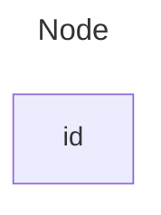
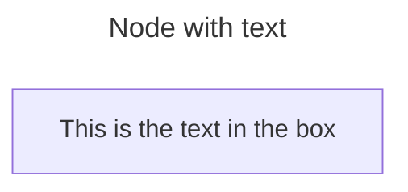
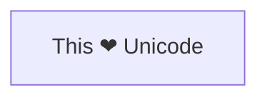
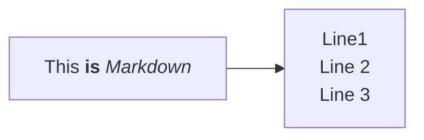
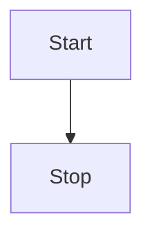
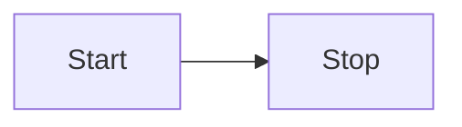

# mermaidで記述できるダイアグラムのチュートリアル

## フローチャート

### ノード
コード:
```
---
title: Node
---
flowchart LR
    id
```


#### テキストを含むノード
ボックス内にIDとは異なるテキストを設定することも可能です。これを数回行うと、ノードで許可された最後のテキストが使用されます。また、以降のノードのエッジを定義する場合は、テキスト定義ボックスを適宜する際、以前に定義したものが使用されます。

コード:
```
---
title: Node with text
---
flowchart LR
    id1[This is the text in the box]
```


#### Unicode テキスト
"Unicode テキストを囲むために使用します。
コード：
```
flowchart LR
    id["This ❤ Unicode"]
```


#### マークダウン形式
二重引用符とバッククォート「text」を使用してマークダウン テキストを囲みます。

コード：
```
%%{init: {"flowchart": {"htmlLabels": false}} }%%
flowchart LR
    markdown["`This **is** _Markdown_`"]
    newLines["`Line1
    Line 2
    Line 3`"]
    markdown --> newLines
```



### 方向

このステートメントはフローチャートの方向を宣言します。
これは、フローチャートが上から下 (TDまたはTB) の方向であることを宣言します。
コード：
```
flowchart TD
    Start --> Stop
```


これは、フローチャートが左から右に向けられることを宣言します ( LR)。

コード：
```
flowchart LR
    Start --> Stop
```

可能なフローチャートの方向は次のとおりです。

TB - 上から下へ
TD - トップダウン/上から下と同じ
BT - 下から上へ
RL - 右から左へ
LR - 左から右へ


引用元:[About diagram | Mermaid](https://mermaid.js.org/syntax/gantt.html)